# Project_-BOOKISH-

Design and implement an online book sharing and exchanging Website - “BOOKISH”.

Tools:
---
HTML, CSS, PHP, Java Script, SQL.

Description:
---
A Book sharing and Exchanging Platform where every user can create their profile, Post to share/exchange or both including price, screenshots, documentation etc., see others posts on their feed, and finally they can communicate to share or exchange books.

How to run:
---
1. copy and pest the "bookish_code" folder to "C:\xampp\htdocs" directory.
2. run Apache and MySQL servers from XAMPP control panel.
3. brows http://localhost/phpmyadmin/ from any browser.
4. create a databse named "atik" from phpmyadmin dashboard.
5. hit the "SQL" button and copy pest the codes from "bookish_data.sql" file to editor and hit the "GO" button to create the database.
6. run http://localhost/bookish_code/ from browser.
7. there you go :XD

Some Screenshotes:
---
Home page
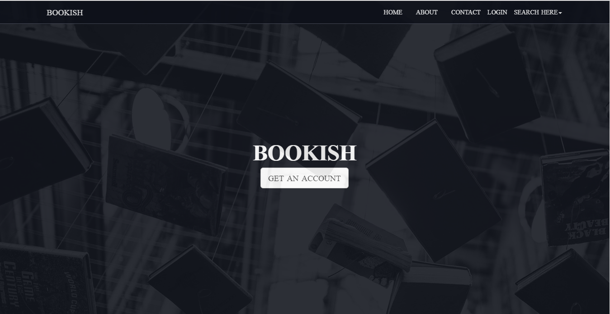

About page:
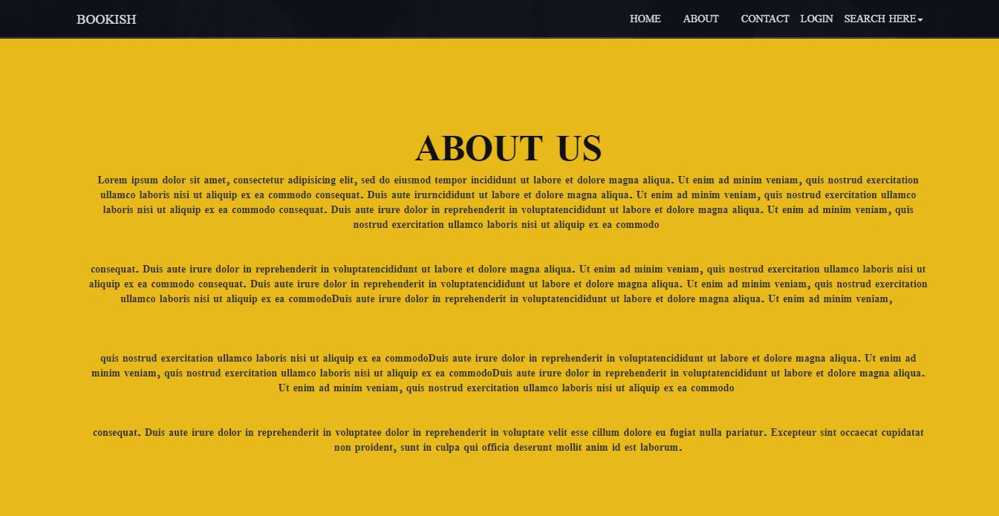

Sign up page:
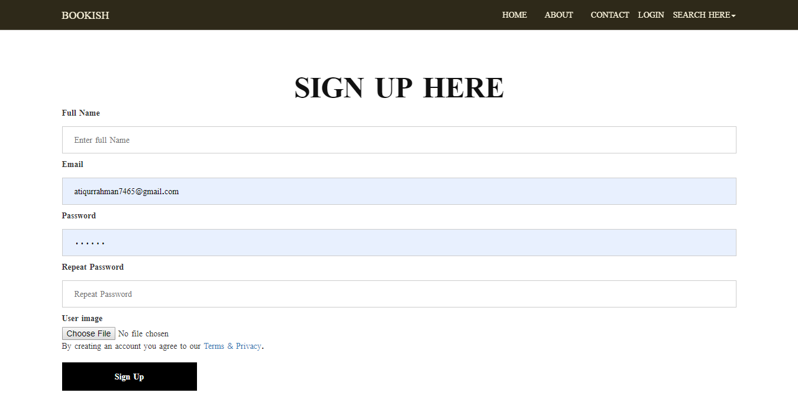

Contact us page:
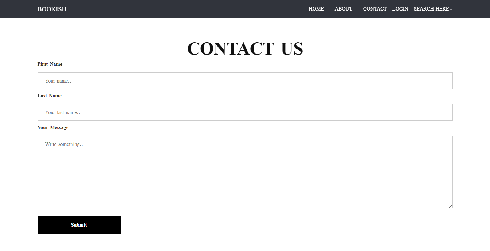

Footer:
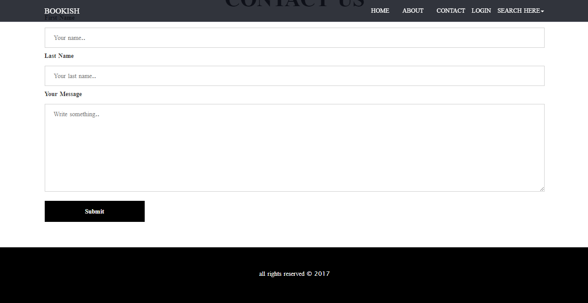

Login popup:
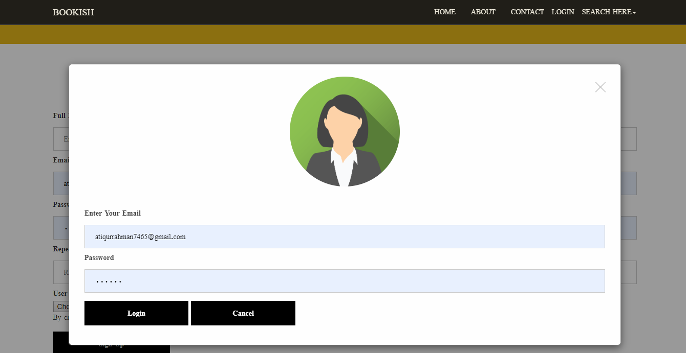

User interface:
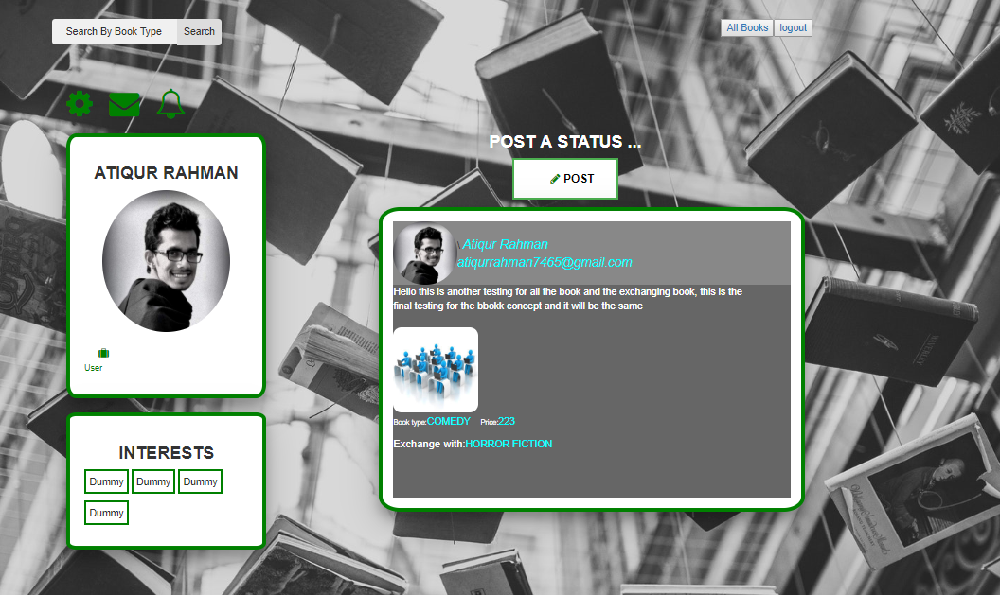

Status Post Form:
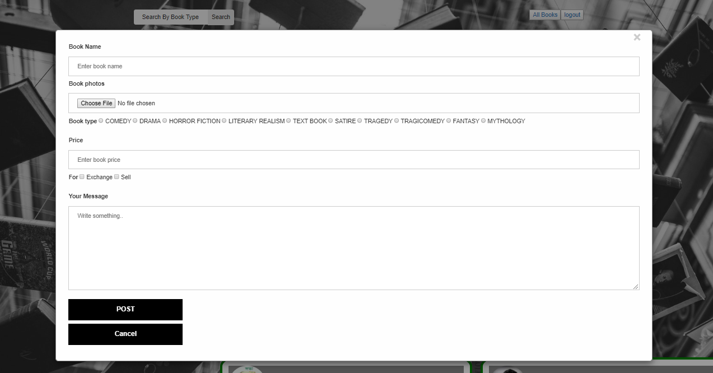

Newsfeed:
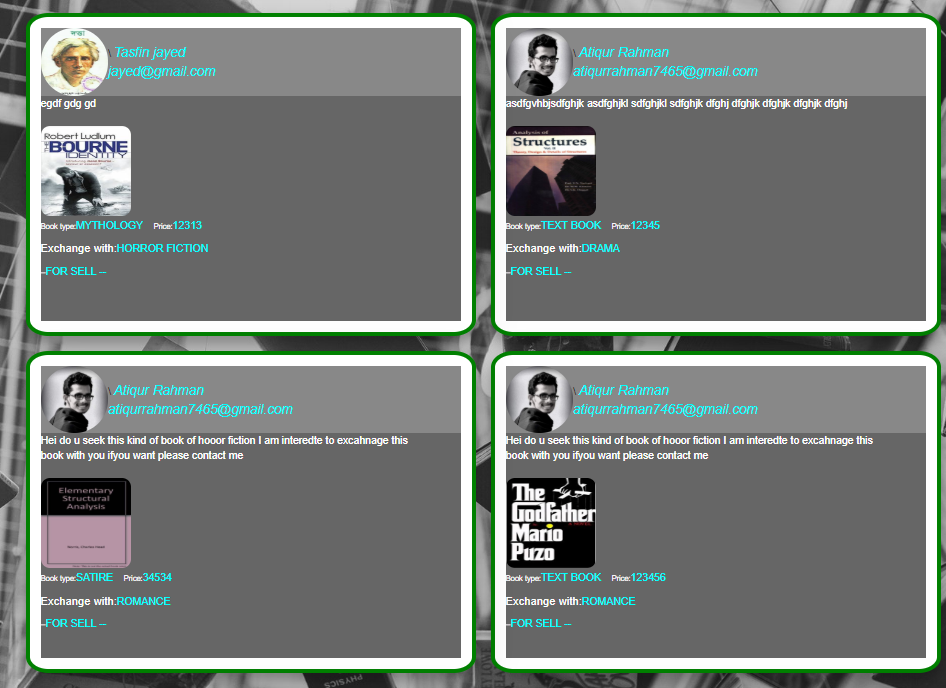

Custom Book Search:
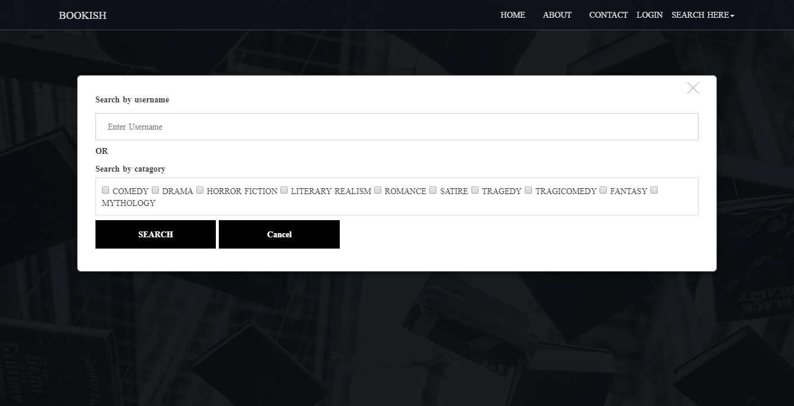

Custom Book Search:
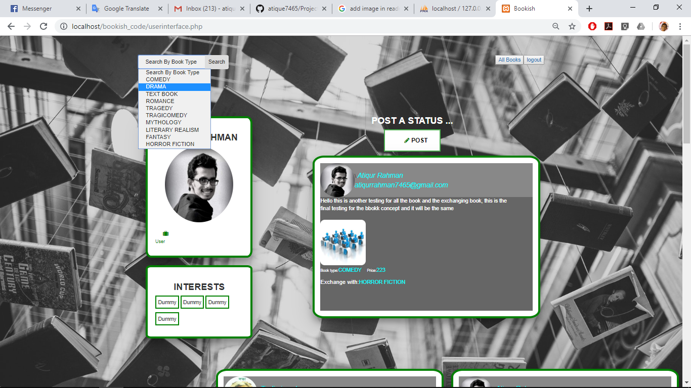

Account Settings Page:
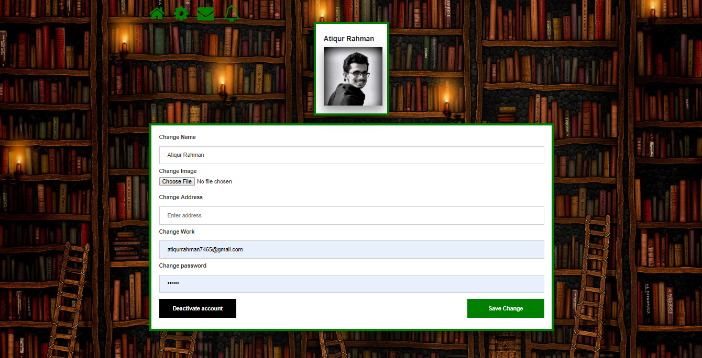

Databage:
---
User databage:
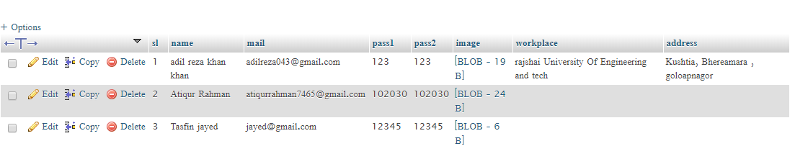

User Post Databage:
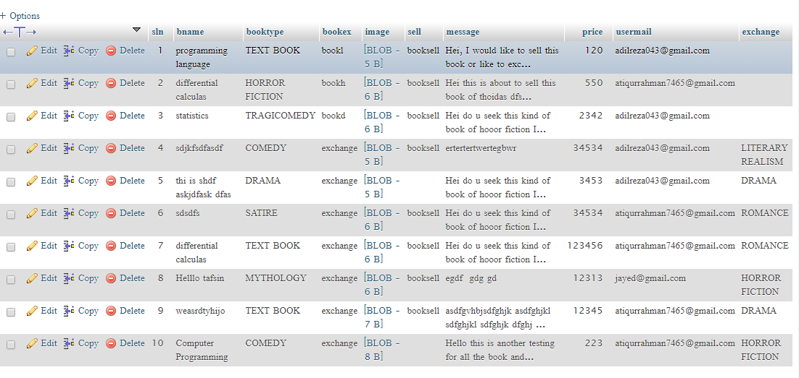
